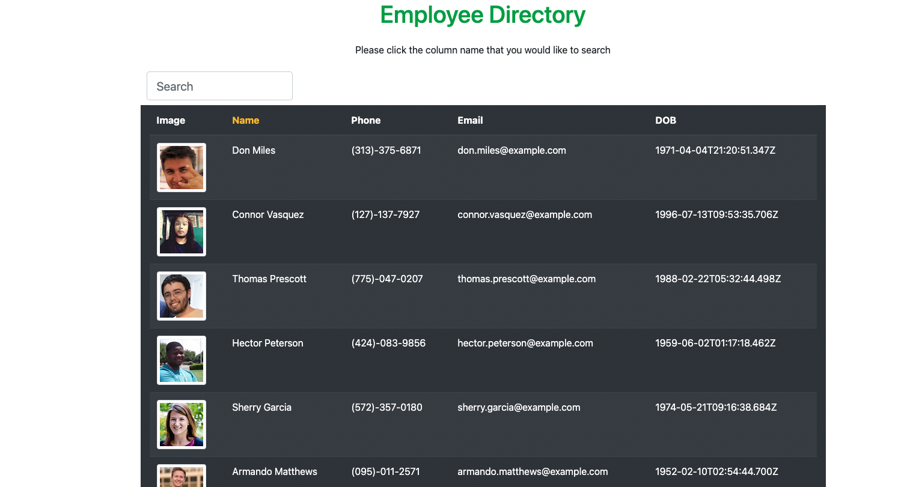
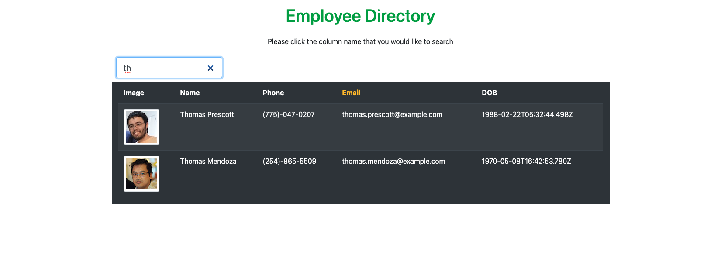

Employee Directory

## Description

This application will search a list of employees by First name, Email, Phone number, or DOB. This is a React application.

## Table of Contents

- [Installation](#installation)
- [Usage](#usage)
- [Contributing](#contributing)
- [Tests](#tests)
- [Questions](#questions)
- [License](#license)

## Installation

This project is deployed so it will work by clicking the link, then clicking the column that the user would like to search, as the user types a query, the results populate on the screen.

## Usage

This project can be accesses at the link and Github repo below.
[Deployed](https://condescending-nobel-29ef6b.netlify.app/)
[Repo](https://github.com/jasdjames/employee-directory-react)

## Contributing

Contribution is open and welcome on all projects.

## Tests

No tests were necessary.

## Questions

Please contact me by Github or email address
[JasDJames]
(https://github.com/JasDJames)
jasdjames@gmail.com

## License

MIT
MIT License

    Copyright (c) [year] [fullname]

    Permission is hereby granted, free of charge, to any person obtaining a copy
    of this software and associated documentation files (the "Software"), to deal
    in the Software without restriction, including without limitation the rights
    to use, copy, modify, merge, publish, distribute, sublicense, and/or sell
    copies of the Software, and to permit persons to whom the Software is
    furnished to do so, subject to the following conditions:

    The above copyright notice and this permission notice shall be included in all
    copies or substantial portions of the Software.

    THE SOFTWARE IS PROVIDED "AS IS", WITHOUT WARRANTY OF ANY KIND, EXPRESS OR
    IMPLIED, INCLUDING BUT NOT LIMITED TO THE WARRANTIES OF MERCHANTABILITY,
    FITNESS FOR A PARTICULAR PURPOSE AND NONINFRINGEMENT. IN NO EVENT SHALL THE
    AUTHORS OR COPYRIGHT HOLDERS BE LIABLE FOR ANY CLAIM, DAMAGES OR OTHER
    LIABILITY, WHETHER IN AN ACTION OF CONTRACT, TORT OR OTHERWISE, ARISING FROM,
    OUT OF OR IN CONNECTION WITH THE SOFTWARE OR THE USE OR OTHER DEALINGS IN THE
    SOFTWARE.
